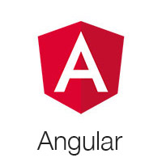
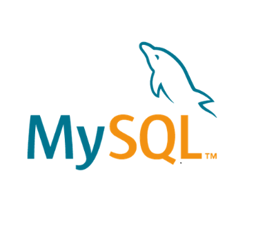
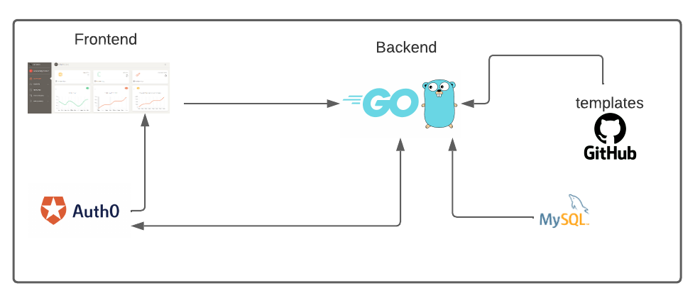

# Bitbark

 [](https://github.com/Kubexperts/bitbark/issues?q=is%3Aopen+is%3Aissue) [](https://github.com/Kubexperts/bitbark/issues?q=is%3Aissue+is%3Aclosed)

[](https://github.com/gomods/athens)


**Bitbark is a tool to deploy pre-built IaC templates.**

> NOTE: Currently, Bitbark only supports CloudFormation templates for AWS. In future updates, additional providers and infrastructure-as-code tools may be introduced, expanding the range of options and flexibility.

## Table of Contents

* [Summary](#summary)
* [Technologies](#technologies)
* [Architecture](#architecture)
* [Quick Start](#quick-start)
* [File Structure](#file-structure)
* [Resources](#resources)
* [Reporting Issues](#reporting-issues)
* [Licensing](#licensing)
* [Useful Links](#useful-links)


## Summary
This tool not only streamlines the deployment of cloud infrastructures but also takes an organized and efficient approach by allowing users to group resources intuitively. Through the graphical interface, users can organize their deployments based on projects, stacks, and credentials, facilitating the quick management and execution of templates for specific configurations.

**Additional Features:**

1. **Organization by Projects:**
  - Enables users to group resources based on projects, providing a logical structure for organizing and managing related deployments.

2. **Configuration by Stacks:**
  - Facilitates the grouping of resources into stacks, allowing for more detailed and modular management of infrastructure.

3. **Credentials Management:**
  - Offers the ability to securely store and manage credentials, allowing controlled access to different cloud environments and services.

4. **Rapid Deployment:**
  - Allows for the swift deployment of specific templates associated with preconfigured projects, stacks, and credentials, simplifying the process.

5. **History and Tracking:**
  - Records a detailed history for each project and stack, providing a comprehensive view of previous deployments and changes.

6. **Efficient Reuse:**
  - Facilitates the reuse of configurations and templates as users can efficiently manage and quickly deploy predefined sets for similar projects.

This tool not only simplifies infrastructure deployment but also enhances organization and efficiency by allowing users to quickly manage, deploy, and maintain templates based on specific projects, stacks, and credentials.

## Technologies
[](https://angular.io/)
[](https://go.dev/)
[](https://auth0.com/)
[](https://www.mysql.com/)


## Architecture



## Quick start

### Ngrok
To enable the backend for the successful enrollment of a new user, it is necessary to expose the backend itself. The user enrollment procedure concludes with Auth0 initiating an API call to the backend endpoint after user login. Any proxy tool can be employed for this purpose, with the objective being to make the backend accessible over the internet for Auth0 to call.

Follow these steps to achieve this:

1. **Create a new account on [ngrok](https://ngrok.com/)**

2. **Install and configure the ngrok client on your machine**

3. **Execute the following command to forward traffic:**

    ```bash
    ngrok http 8080
    ```

By adhering to these steps, you will expose the backend, ensuring that Auth0 can seamlessly communicate with it, thereby completing the user enrollment process.

### Sentry (Optional)
To streamline the debugging process for your application, consider integrating the Sentry solution.

#### Steps:

1. **Create a new account on Sentry**

2. **Generate a new project and obtain the Sentry DSN string**

3. **Edit the `.env` file**
    ```bash
    SENTRY_DSN = 'sentry_dsn'
    ```

By following these steps, you'll seamlessly integrate Sentry into your application, empowering you to efficiently identify and address issues during the debugging process.


### Auth0
1. **Create a new Auth0 tenant**

2. Navigate to **Applications → APIs → Auth0 Management API,** select the **API Explorer** tab, and create & authorize a test application.

3. Retrieve the Domain, Client ID, and Client Secret from the API Explorer Application.

4. Replace this data in the `config.json` file:

    ```json
    {
      "AUTH0_DOMAIN": "auth0_domain",
      "AUTH0_CLIENT_ID": "auth0_client_id",
      "AUTH0_CLIENT_SECRET": "auth0_client_secret",
      "AUTH0_KEYWORD_REPLACE_MAPPINGS": {
        "AUTH0_DOMAIN": "auth0_domain",
        //...
        "AUTH0_ACTION_BACKEND_DOMAIN_URL": "ngrok_forwarding_url"
      }
    }
    ```

5. Install Auth0 CLI using npm

    ```bash
    npm i auth0-deploy-cli
    ```

6. Navigate to `./src/auth0` and run the following command:

    ```bash
    # Navigate to the directory
    cd ./src/auth0
   
    # Run a0deploy command
    a0deploy import --config_file=config.json --input_file src/tenant.yaml
    ```

These steps will set up and configure your Auth0 environment, ensuring seamless integration with your application.


### Frontend 


1. **Install npm v9.6.7**

2. **Configure ./src/view/src/app/constants.ts**

   Edit the exported class `Constants`:
   ```typescript
   export class Constants {
       // ... 
       public static AUTH0_CLIENT_ID = 'auth0_client_id_frontend_app';
       public static AUTH0_DOMAIN = 'auth0_domain';
       // ...
   }
   ```

3. **Run Angular project**

   ```bash
   # Navigate to the directory
   cd ./src/view/

   # Install dependencies with legacy peer dependencies support
   npm install --legacy-peer-deps

   # Start the Angular development server
   ng serve
   ```

### Backend
- Create a new MySQL database named `local`.

- Configure `./src/.env`.
    - Replace the following lines with the corresponding information:
    ```yaml
    AUTH0_CLIENT_ID_BACKEND='auth0_client_id_backend_app'
    AUTH0_CLIENT_SECRET_BACKEND='auth0_client_secret_backend_app'
    AUTH0_DOMAIN='auth0_domain'
    MYSQL_PASSWORD='mysql_password'
    MYSQL_USER='mysql_user'
    MYSQL_URL='mysql_server:3306'
    SECRET_CRYPT='secret_crypt_32_bytes'
    ```
- Install the Go interpreter and run the backend:
    - Use the following command in your terminal:
      ```bash
      go run main.go
      ```


### Templates repository
If you want to change the repository for your owner repository, edit the `.env` file with the updated repository URL.

Ensure that the repository is set to public and follows the specified folder structure.

```
bitbark-templates/
└── cloudformation
   ├── folder_template_1
   │   ├── permissions.yml
   │   ├── properties.yml
   │   └── template.yml
   ├── folder_template_2
   │   ├── permissions.yml
   │   ├── properties.yml
   │   └── template.yml
   └──  ...
```


### Files descriptions

**permissions.yml**

Use this file to specify the necessary permissions required to execute the template.

 ```yaml
 ControlAccessService: 'AWS IAM'
 Policy: '{
  "Version": "2012-10-17",
  "Statement": [
    {
      "Sid": "Stmt1686096225470",
      "Action": [
        "ec2:CreateVpc",
        "ec2:CreateSubnet",
        "ec2:DescribeAvailabilityZones",
        "ec2:CreateRouteTable",
        "ec2:CreateRoute",
        "ec2:CreateInternetGateway",
        "ec2:AttachInternetGateway",
        "ec2:AssociateRouteTable",
        "ec2:ModifyVpcAttribute"
      ],
      "Effect": "Allow",
      "Resource": "*"
    }
  ]
}'
```

properties.yml

Use this file to specify the attributes of the template.

```yaml
 Name: vpc-1
 Description: This template deploys a VPC
 Engine: cloudformation
 EstimateCost: "0"
 Provider: "AWS"
```
template.yml

Cloudformation definition. You can use the placeholder ##_## to customize your deployment. 

```yaml
Resources:
  VPC:
    Type: AWS::EC2::VPC
    Properties:
      CidrBlock: ##CidrBlockVpc##
      Tags:
        - Key: Name
          Value: ##TagNameVpc##
  SubnetPublicA:
    Type: AWS::EC2::Subnet
    Properties:
      VpcId: !Ref VPC
      CidrBlock: ##CidrBlockSubnetPublicA##
      AvailabilityZone: ##AvailabilityZoneSubnetPublicA##
      Tags:
        - Key: Name
          Value: ##TagNameSubnetPublicA##
  SubnetPublicB:
    Type: AWS::EC2::Subnet
    Properties:
      VpcId: !Ref VPC
      CidrBlock: ##CidrBlockSubnetPublicB##
      AvailabilityZone: ##AvailabilityZoneSubnetPublicB##
      Tags:
        - Key: Name
          Value: ##TagNameSubnetPublicB##
  SubnetPublicC:
    Type: AWS::EC2::Subnet
    Properties:
      VpcId: !Ref VPC
      CidrBlock: ##CidrBlockSubnetPublicC##
      AvailabilityZone: ##AvailabilityZoneSubnetPublicC##
      Tags:
        - Key: Name
          Value: ##TagNameSubnetPublicC##
```


## File Structure

Within the download you'll find the following directories and files:

```
bitbark/
├── resources
│   └── img
├── src
│   ├── auth0
│   │   ├── src
│   │   └── config.json
│   ├── controller
│   │   ├── routes_credentials.go
│   │   ├── routes_dashboards.go
│   │   ├── routes_initial_setup.go
│   │   ├── routes_profile.go
│   │   ├── routes_projects.go
│   │   ├── routes_stacks.go
│   │   └── routes_templates.go
│   ├── engine
│   │   ├── engine_aws_ami_with_packer.go
│   │   └── engine_aws_cloudformation.go
│   ├── model
│   │   ├── credential_item.go
│   │   ├── dashboard_item.go
│   │   ├── project_item.go
│   │   ├── stack_item.go
│   │   └── template_item.go
│   ├── util
│   │   ├── database.go
│   │   └── utils.go
│   ├── view
│   ├── .env
│   ├── go.mod
│   ├── main.go
└── README.md

```

## Reporting Issues

We use GitHub Issues as the official bug tracker. Here are some advices for our
users that want to report an issue:

1. Make sure that you are using the latest stable version of the Bitbark.
2. Providing us reproducible steps for the issue will shorten the time it takes for it to be fixed.
3. Some issues may be browser specific, so specifying in what browser you encountered the issue might help.

## Licensing

- Copyright 2023 Kubexperts
- License MIT

## Useful Links

- [AWS Cloudformation](https://www.aws.com)


##### Social Media

Github: https://github.com/kubexperts